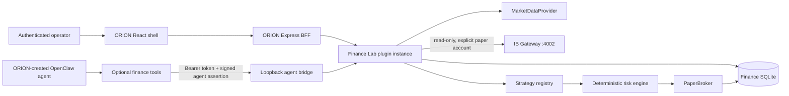
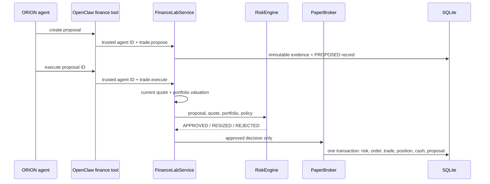

# Architecture

Finance Lab is a capability plugin, not an agent platform. ORION owns agent identity, creation, instructions, memory, sessions, tools policy, and orchestration. Finance Lab references only the immutable agent ID supplied by the trusted OpenClaw tool context.

## Runtime boundaries



| Boundary | Owns | Does not own |
| --- | --- | --- |
| ORION/OpenClaw | Agents, sessions, models, memory, orchestration, tool allowlists | Financial state or risk policy |
| Generic ORION plugin runtime | Package discovery, package-root isolation, authenticated mount points, UI registration, lifecycle | Finance-specific logic |
| Finance Lab | Market adapters, strategies, finance permissions, risk, local paper execution, read-only IBKR paper state, evidence, evaluation, experiments | Agent records, prompts, memory, or live-account routing |
| Market provider | External market retrieval | Portfolio or strategy policy |
| TradingAgents checkout | Its multi-agent research graph and provider configuration | Finance Lab persistence, execution, or risk decisions |

## Boot sequence

1. ORION reads absolute package roots from `ORION_PLUGIN_PATHS`.
2. The generic loader resolves each package and its `package.json#orion.plugin` entry through real paths confined to the package root.
3. Finance Lab creates its SQLite database under the plugin data directory and ensures an empty `$100,000` paper portfolio exists.
4. The plugin registers an API router and built Finance Room assets. ORION mounts them only after initialization succeeds.
5. When both Finance bridge secrets exist, the same Finance Lab service starts a loopback-only bridge for agent tools.
6. The OpenClaw plugin derives the immutable agent ID from tool context, selects that agent's configured permissions, and signs a short-lived assertion with a separate key. The bridge verifies the signature, timestamp, and one-time nonce before constructing the actor.
7. Shutdown closes the bridge, prediction timer, database, and ORION plugin lifecycle in order.

## IBKR paper boundary

`FINANCE_BROKER_MODE=ibkr-paper` creates a loopback-only `IbkrGatewayClient`. The Node client invokes a one-shot Python bridge using IBKR's official `ibapi` package, verifies that the explicitly configured account is present, and reads account summary plus positions. It never chooses an account implicitly and exposes only a masked account identifier to the dashboard.

During read-only verification, IBKR balances and positions replace the local default portfolio snapshot. The local SQLite database still owns proposals, evidence, predictions, audit records, experiments, and historical valuations. `trade.execute` fails with `IBKR_READ_ONLY`; it cannot fall through to `PaperBroker`.

## Decision and execution flow



There is no service method that accepts an unconstrained LLM order and writes directly to a broker.

## State model

| Table | Role |
| --- | --- |
| `portfolios` | Paper cash account and experiment/strategy/agent references. |
| `positions` | Quantity, average cost, and realized P&L by portfolio and symbol. |
| `trade_proposals` | Agent proposal and current deterministic decision state. |
| `risk_events` | Policy, portfolio snapshot, reasons, requested quantity, and approved quantity. |
| `orders`, `trades` | Filled paper order and immutable execution facts. |
| `predictions`, `prediction_results` | Append-only forecast and separately stored evaluation. |
| `evidence_manifests` | Immutable reproducibility record for a decision. |
| `experiments` | Fixed starting assumptions and isolated portfolio link. |
| `market_data_metadata` | Provider and source provenance for external reads. |
| `portfolio_valuations` | Point-in-time values used for risk-adjusted metrics. |
| `audit_log` | Structured action, identity, finance IDs, result, cost fields, and latency. |
| `finance_agents`, `finance_teams`, `finance_team_members` | Dashboard-managed assignment of existing ORION agent IDs and Finance Lab team membership. |

Finance Lab stores the immutable ORION agent ID plus the display name and Finance role supplied by the authenticated dashboard when an agent is assigned. It does not create an agent, copy its prompt or credentials, or own its lifecycle.

## Strategy contract

Every strategy returns the same core shape:

```json
{
  "strategyId": "quant-core",
  "symbol": "NVDA",
  "signal": "BUY",
  "score": 0.63,
  "confidence": 0.74,
  "timeHorizon": "30d",
  "thesis": "...",
  "evidence": [],
  "models": [],
  "costs": { "tokens": 0, "apiCost": 0, "currency": "USD" },
  "latencyMs": 24,
  "metadata": {}
}
```

`score` is normalized to `[-1, 1]`; `confidence` is normalized to `[0, 1]`. BUY/HOLD/SELL is a presentation field, not the only evaluation signal.

## Prediction lifecycle

1. An authorized agent appends a direction, return range, horizon, confidence, thesis, invalidation conditions, benchmark, and evidence manifest.
2. Finance Lab stores the current price and due time without modifying the original prediction later.
3. An hourly process-local evaluator selects due predictions without results.
4. It obtains end and benchmark history, calculates actual return, direction correctness, range correctness, benchmark return, and alpha, then inserts one result row.
5. Provider failures leave the prediction pending for retry.
6. Agent performance and calibration are computed from the original prediction/result pairs.

## Deployment modes

| Mode | State owner | Dashboard | Agent bridge |
| --- | --- | --- | --- |
| Integrated | Finance plugin inside ORION BFF | Yes | Same instance, when token configured |
| Standalone | `src/standalone.js` | No | Yes |

Do not run both modes against one installation at the same time. Integrated mode is the only mode that proves dashboard and agent tools operate on the same state.
