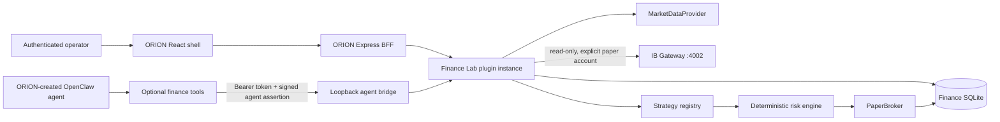
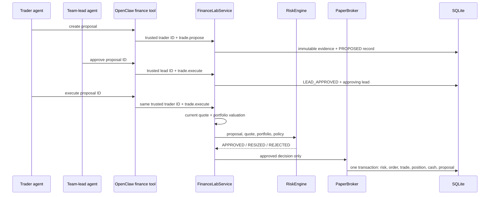

# Architecture

Finance Lab is a capability plugin, not an agent platform. ORION owns agent identity, creation, instructions, memory, sessions, tools policy, and orchestration. Finance Lab references only the immutable agent ID supplied by the trusted OpenClaw tool context.

## Runtime boundaries



| Boundary | Owns | Does not own |
| --- | --- | --- |
| ORION/OpenClaw | Agents, sessions, models, memory, orchestration, tool allowlists | Financial state or risk policy |
| Generic ORION plugin runtime | Package discovery, package-root isolation, authenticated mount points, UI registration, lifecycle | Finance-specific logic |
| Finance Lab | Market adapters, strategies, finance permissions, risk, local paper execution, read-only IBKR paper state, evidence, evaluation, experiments, team lessons graded from its own outcomes | Agent records, prompts, memory, or live-account routing |
| Market provider | External market retrieval | Portfolio or strategy policy |
| TradingAgents checkout | Its multi-agent research graph and provider configuration | Finance Lab persistence, execution, or risk decisions |

## Boot sequence

1. ORION reads absolute package roots from `ORION_PLUGIN_PATHS`.
2. The generic loader resolves each package and its `package.json#orion.plugin` entry through real paths confined to the package root.
3. Finance Lab creates its SQLite database under the plugin data directory and ensures an empty `$100,000` paper portfolio exists.
4. The plugin registers an API router and built Finance Room assets. ORION mounts them only after initialization succeeds.
5. When both Finance bridge secrets exist, the same Finance Lab service starts a loopback-only bridge for agent tools.
6. The OpenClaw plugin derives the immutable agent ID from tool context, selects that agent's configured permissions, and signs a short-lived assertion with a separate key. The bridge verifies the signature, timestamp, and one-time nonce before constructing the actor.
7. Shutdown closes the bridge, prediction timer, database, and ORION plugin lifecycle in order.

## IBKR paper boundary

`FINANCE_BROKER_MODE=ibkr-paper` creates a loopback-only `IbkrGatewayClient`. The Node client invokes a one-shot Python bridge using IBKR's official `ibapi` package, verifies that the explicitly configured account is present, and reads account summary plus positions. It never chooses an account implicitly and exposes only a masked account identifier to the dashboard.

IBKR balances and positions replace the local default portfolio snapshot. The local SQLite database still owns proposals, evidence, predictions, audit records, experiments, and historical valuations.

`FINANCE_IBKR_EXECUTION` decides what execution may reach the broker, and it is `off` by default: `trade.execute` fails with `IBKR_READ_ONLY` and cannot fall through to `PaperBroker`. In `dry-run`, the deterministic risk engine sizes the order and the bridge places it with IBKR `Order.whatIf`, so IBKR validates the contract, account, and margin impact and returns a preview without ever placing an order. No trade, position, or valuation is written from a preview. The order account is always pinned to the allowlisted paper account, re-resolved per order.

`live` transmits a real paper order. IB Gateway must also have **Read-Only API** unchecked in Configuration → API → Settings; while it is checked, IBKR refuses even a `whatIf` preview with error 321.

### Booking a live fill

A live order is the broker's event, not the lab's, so the lab does not decide what it cost:

- Each accepted order becomes a `broker_orders` row holding IBKR's `permId` — the only order identifier stable across API sessions — plus the per-session client order id, the masked account, and IBKR's own status.
- The order is booked into `orders` and `trades` only when filled quantity, average fill price, and IBKR's commission report are all known. A fill whose commission has not arrived yet stays `WORKING`; nothing is written at an assumed fee.
- Cash and positions move through the same ledger path as a simulated fill, so the two can never disagree about a portfolio. The recorded slippage is `0`: a real fill carries its slippage inside the executed price.
- `POST /broker/reconcile` re-reads IBKR's open orders and executions and settles anything still working. A booked order leaves `WORKING`, and a unique index on `broker_orders.broker_order_id` means the same IBKR order can never be booked twice.
- Before transmission, Finance Lab atomically persists the risk decision and moves the proposal to `SUBMITTING`. The proposal ID is sent as IBKR `orderRef`, allowing reconciliation to adopt an open order or execution if the placing request times out after transmission.
- Missing from one open-order/execution snapshot is treated as ambiguous, not cancelled. Only an explicit terminal broker status can cancel an unfilled order.
- An order IBKR reports as terminal with nothing filled is marked `CANCELLED` and its proposal returns to `REJECTED` rather than resting forever.
- A proposal that already has a broker order is refused before transmission, so a repeated execute cannot send a duplicate order to IBKR.

## Team portfolios and hierarchy

Every finance team owns one paper portfolio, and `finance_team_members.team_rank` orders the team with rank 1 as its lead. A non-lead member whose assigned role contains `Trader` creates the proposal. The current rank-1 lead must approve it, and the same trader then submits it to the broker. Approval records the lead identity and becomes invalid if leadership changes before submission. Agents read their own place in the hierarchy through `GET /finance-teams/context` rather than being told it in a prompt.

### Autonomous team cycles

In IBKR live paper mode, the service reconciles unresolved submissions and working orders at startup and every 15 seconds after the previous check finishes. Confirmed fills and commissions settle through the existing ledger path exactly once. Polling skips Gateway calls when no orders need settlement, retries connection failures on the next check, and drains active settlement before SQLite closes. Manual trader reconciliation remains scoped to the caller's team. The dashboard refreshes every five seconds while an order is unresolved, including across tab navigation.

The Finance Room's **Start Trading** action authorizes one paper cycle. The coordinator runs research → lead strategy → trader proposal → lead approval → trader submission using the team's stored roles. Strategy planning authorizes drafting; it does not approve an order. The lead must approve the concrete proposal before its proposing trader can submit.

Every research, planning, and proposal handoff includes the team's current paper portfolio, risk policy, and execution mode. Lead approval receives a refreshed portfolio, the full proposal thesis, research, lead strategy, a source-stamped quote, and an indicative sizing check. Execution still reruns the authoritative risk and cost checks.

Research considers up to three candidates within supported capabilities: cash-funded buys of permitted equities/ETFs and sells of held positions. A sell cannot open a short; options and atomic paired orders are unsupported. Team disposition guides analysis. Neutral disposition means choosing without a fixed directional bias; an explicit portfolio mandate still governs. Ordinary uncertainty can justify a smaller paper position, while insufficient evidence or a hard risk limit can justify no trade.

No-trade and explicit rejection reasons remain visible in the cycle status. Completed, stopped, and failed cycles also write their outcome to the existing SQLite `audit_log` under `finance.team.trading.complete`. A missing or malformed lead decision fails the cycle and leaves its proposal unresolved; it never becomes implicit approval or a fabricated investment rejection. The cycle status remains process-local, while the audit survives restarts.

### Learning from graded decisions

Each cycle's proposal carries a forecast from the trader: horizon, confidence, expected return range, and invalidation. The coordinator records it as an ordinary prediction owned by the trader and links it to the proposal through `trade_proposals.prediction_id`. The record is made before lead review, so rejected drafts are graded too. The existing hourly prediction evaluator scores it. A proposal with a missing or invalid forecast still trades, but it is never graded.

Before research, each cycle reviews up to three graded, decided proposals that have not been reviewed yet:

- A correct decision is marked reviewed without a model call.
- A mistake gets a lead post-mortem turn. A mistake is a taken trade that moved against its forecast, or a declined trade whose forecast came true. The lead returns either a `Trigger / Better approach / Avoid / Verify` lesson or `NONE` when the outcome looks like noise or a hard risk limit decided it.
- A failed turn leaves the decision for a later cycle. A malformed reply is final, so one bad decision cannot stall the queue.

Lessons live in `team_lessons` in the Finance SQLite database, one per proposal at most. The five most recent active lessons are passed to the research, strategy, proposal, and lead-review handoffs. They never override current evidence or the deterministic risk engine.

Each proposal records which lessons its cycle was shown (`proposal_lessons`). Lessons are scored by exposure: once a lesson has been shown on six graded decisions, its correct rate is compared with the team's decisions made without it. With no such decisions, it is compared with a coin flip. A lesson that does not beat that baseline is retired with its numbers as the reason. All active lessons are shown together, so this is attribution by exposure rather than a controlled trial. The operator can also retire a lesson from the team's portfolio card.

When ORION provides plugin memory, active lessons are mirrored into the shared second brain as `shared_lesson` notes, keyed per lesson and tagged with the plugin ID. Retired lessons are removed. Finance SQLite stays the source of truth: if the vault is unavailable, sync is retried on the next cycle.

## Decision and execution flow



There is no service method that accepts an unconstrained LLM order and writes directly to a broker.

## State model

| Table | Role |
| --- | --- |
| `portfolios` | Paper cash account and experiment/strategy/agent references. |
| `positions` | Quantity, average cost, and realized P&L by portfolio and symbol. |
| `trade_proposals` | Agent proposal and current deterministic decision state. |
| `risk_events` | Policy, portfolio snapshot, reasons, requested quantity, and approved quantity. |
| `orders`, `trades` | Filled paper order and immutable execution facts. |
| `predictions`, `prediction_results` | Append-only forecast and separately stored evaluation. |
| `evidence_manifests` | Immutable reproducibility record for a decision. |
| `experiments` | Fixed starting assumptions and isolated portfolio link. |
| `market_data_metadata` | Provider and source provenance for external reads. |
| `portfolio_valuations` | Point-in-time values used for risk-adjusted metrics. |
| `audit_log` | Structured action, identity, finance IDs, result, cost fields, and latency. |
| `finance_agents`, `finance_teams`, `finance_team_members` | Dashboard-managed assignment of existing ORION agent IDs and Finance Lab team membership. |

Finance Lab stores the immutable ORION agent ID plus the display name and Finance role supplied by the authenticated dashboard when an agent is assigned. It does not create an agent, copy its prompt or credentials, or own its lifecycle.

## Strategy contract

Every strategy returns the same core shape:

```json
{
  "strategyId": "quant-core",
  "symbol": "NVDA",
  "signal": "BUY",
  "score": 0.63,
  "confidence": 0.74,
  "timeHorizon": "30d",
  "thesis": "...",
  "evidence": [],
  "models": [],
  "costs": { "tokens": 0, "apiCost": 0, "currency": "USD" },
  "latencyMs": 24,
  "metadata": {}
}
```

`score` is normalized to `[-1, 1]`; `confidence` is normalized to `[0, 1]`. BUY/HOLD/SELL is a presentation field, not the only evaluation signal.

## Prediction lifecycle

1. An authorized agent appends a direction, return range, horizon, confidence, thesis, invalidation conditions, benchmark, and evidence manifest.
2. Finance Lab stores the current price and due time without modifying the original prediction later.
3. An hourly process-local evaluator selects due predictions without results.
4. It obtains end and benchmark history, calculates actual return, direction correctness, range correctness, benchmark return, and alpha, then inserts one result row.
5. Provider failures leave the prediction pending for retry.
6. Agent performance and calibration are computed from the original prediction/result pairs.

## Deployment modes

| Mode | State owner | Dashboard | Agent bridge |
| --- | --- | --- | --- |
| Integrated | Finance plugin inside ORION BFF | Yes | Same instance, when token configured |
| Standalone | `src/standalone.js` | No | Yes |

Do not run both modes against one installation at the same time. Integrated mode is the only mode that proves dashboard and agent tools operate on the same state.
